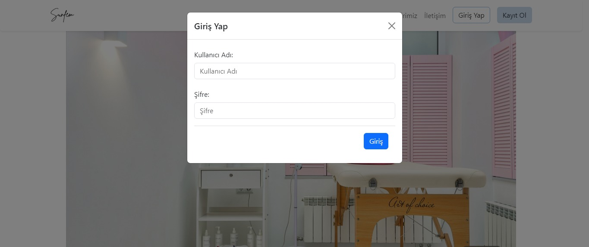
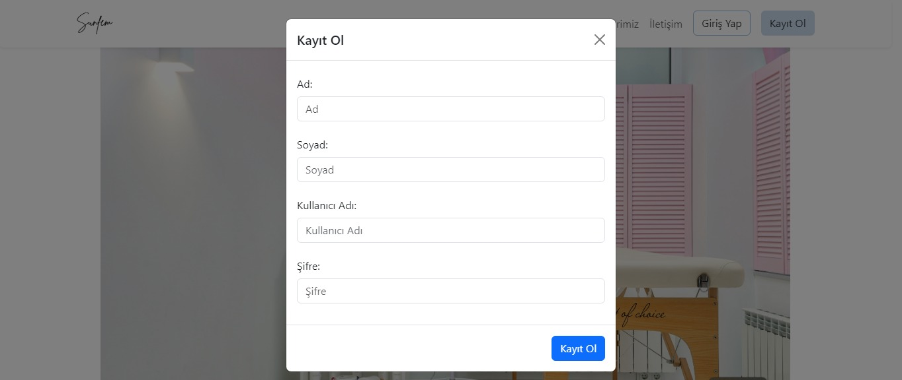
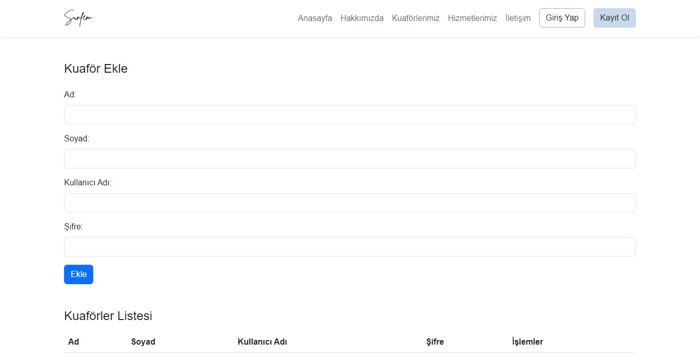
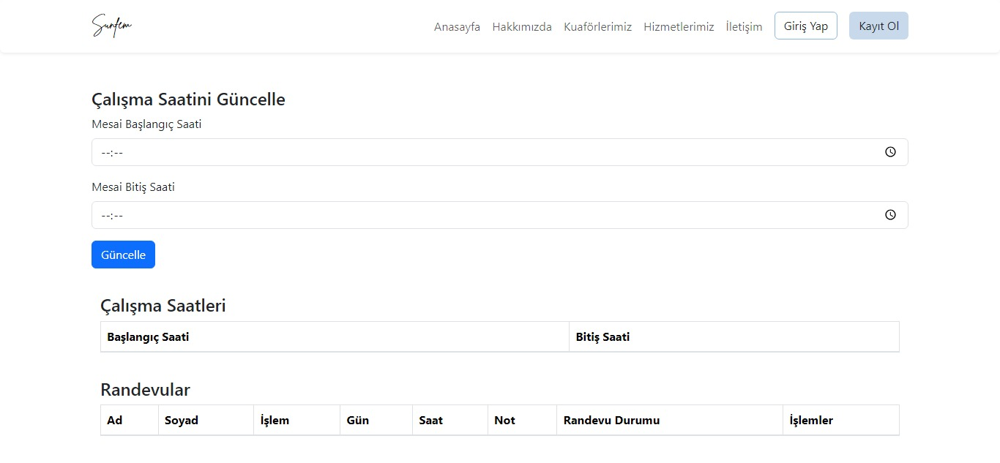
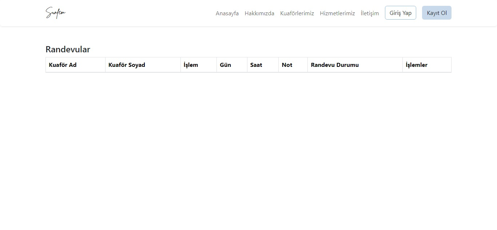
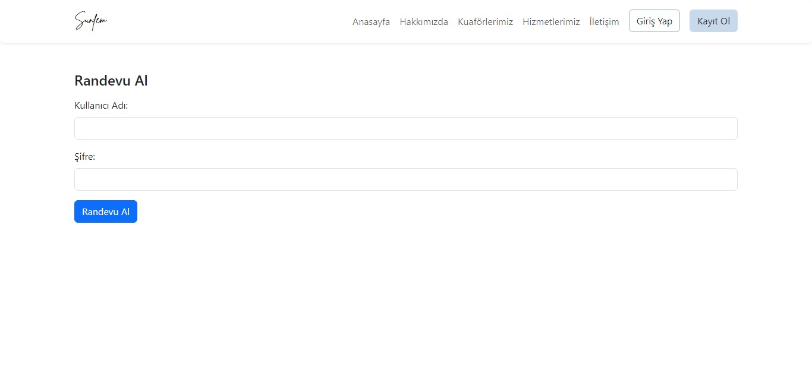
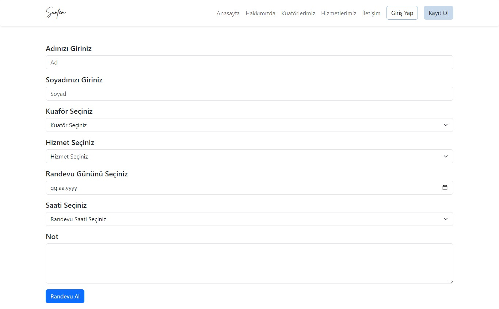

# Kuaför Randevu Sistemi

## Projenin Amacı

Bu proje, kuaför salonumuzun müşteri ve kuaför bilgilerini tek bir platformda yönetmeyi amaçlamaktadır. Sistem, müşterilerin online olarak randevu almasını sağlayarak işlemleri daha verimli hale getirmeyi hedeflemektedir. Ayrıca, kuaförlerin çalışma saatlerini ayarlamalarına ve randevularını yönetmelerine olanak tanır.

## Kapsam

1. Müşteri Sayfası:
   - Müşteriler, kendi ad soyad bilgilerini kullanarak sisteme giriş yapabilir ve randevu taleplerini oluşturabilir.
   - Müşteriler, randevu taleplerini görebilir, onaylanmış randevuları iptal edebilir ve geçmiş randevularını inceleyebilirler.

2. Kuaför Sayfası:
   - Kuaförler, çalışma saatlerini belirleyebilir ve istedikleri zaman güncelleyebilirler.
   - Kuaförler, gelen randevuları görüntüleyebilir, onaylayabilir, reddedebilir veya beklemede bırakabilirler.

3. Admin Paneli:
   - Admin, kuaför bilgilerini ekleyebilir, düzenleyebilir ve silebilir.
   - Admin, sistemi genel olarak yönetebilir ve kullanıcıların yetkilerini kontrol edebilir.

4. Giriş ve Kayıt Ol:
   - Kullanıcılar, sisteme giriş yapmak veya yeni hesap oluşturmak için kullanıcı adı ve şifre bilgilerini kullanabilirler.

Bu sistem, kuaför salonumuzun randevu yönetim süreçlerini dijitalleştirerek müşteri memnuniyetini artırmayı ve kuaför çalışanlarının işlemlerini daha etkili bir şekilde yönetmeyi hedeflemektedir.

# Anasayfa

Hoş geldiniz! Kuaför randevu sistemimize giriş yaptığınızda sizi sıcak bir atmosferle karşılamaktan memnuniyet duyarız. 

## Navigasyon

Sitemizde bulunan navigasyon (navbar) bağlantıları size ilgili başlıklara yönlendirir:

- Hakkımızda:
  Salonumuzla ilgili detaylı bilgileri burada bulabilirsiniz. 

- Kuaförler:
  Kuaför ekibimizin resimleri ve bilgileri bu sayfada yer almaktadır.

- Hizmetler:
  Sunduğumuz hizmetler ve bu hizmetlerin fiyatları hakkında bilgiler içerir.

- İletişim:
  Bizimle iletişime geçmek için mail ve telefon bilgilerimizi bulabileceğiniz sayfadır.

- Giriş Yap / Kayıt Ol:
  Randevu almak için giriş yapabilir veya kayıt olabilirsiniz.

# Giriş Ekranı

Giriş ekranını Spring Security ile yazılmıştır. Kuafor, Müşteri ve Admin kullanıcıları için tek bir giriş ekranında erişim sağlanmaktadır.

- *Spring Security:*
  Giriş ekranı, güvenliği Spring Security ile sağlanmıştır. Kullanıcılar, kendi rollerine göre sistemde farklı yetkilere sahiptirler.

- *Tek Giriş Ekranı:*
  Kuafor, Müşteri ve Admin kullanıcıları için tek bir giriş ekranı, kullanıcı kimliğine göre ilgili sayfalara yönlendirme yapar.

## Kayıt Ol Ekranı

- *Kullanıcı Kaydı:*
  Kayıt ol ekranında, kullanıcılar ad, soyad, kullanıcı adı ve şifre bilgilerini belirleyerek sisteme kayıt olabilirler.

- *Müşteri Olarak Hizmet Almaya Başlama:*
  Kayıt olan kullanıcılar, müşteri olarak sisteme dahil olup randevu sistemini kullanmaya başlayabilirler.

# Admin Sayfası

Admin sayfamız, bir kuaför yönetim sistemi içermektedir. Sistemde bulunan admin paneli sayesinde, kuaför bilgileri kolayca yönetilebilir.

## Özellikler

- Kuaför Ekleme:
  Admin paneli üzerinden kuaför bilgileri, adı, soyadı, kullanıcı adı ve şifre ile birlikte eklenerek kullanıcı rolü atanabilir.

- Kuaför Listeleme:
  Admin, eklenen kuaför bilgilerine erişebilir ve onları görüntüleyebilir.

- Kuaför Güncelleme:
  Admin, işlemler sütununda bulunan "Düzenle" seçeneği ile kuaför bilgilerini güncelleyebilir.

- Kuaför Silme:
  Admin, işlemler sütununda bulunan "Sil" seçeneği ile kuaför bilgilerini silebilir.

# Kuafor Sayfası  

Bu sayfa, kuaforlerimizin çalışma saatlerini yönetmelerine, randevularını görüntülemelerine ve işlemlerini gerçekleştirmelerine olanak tanır.

## Çalışma Saatleri Ayarlama ve Güncelleme

Kuaforlerimiz, kendi çalışma saatlerini başlangıç ve bitiş saatleri olarak ayarlayabilir ve istedikleri zaman güncelleyebilirler.

## Randevu Yönetimi

- Randevu Görüntüleme:
  Kuaforler, randevularını görüntüleyebilir ve planlarını görebilirler.

- Randevu Onaylama:
  İşlemler sütunundan "Onayla" seçeneği ile kuaforler, gelen randevuları onaylayabilirler.

- Randevu Reddetme:
  İşlemler sütunundan "Reddet" seçeneği ile kuaforler, gelen randevuları reddedebilirler.

- Randevu Beklemede Bırakma:
  İşlemler sütunundan "Beklemede" seçeneği ile kuaforler, gelen randevuyu beklemeye alabilirler. 

- Randevu Durumu Güncelleme:
  Kuaforlerin onaylama, reddetme veya beklemede bırakma işlemleri sonucunda randevu durumu otomatik olarak güncellenir.

#Musteri Sayfası 

Bu sayfa, müşterilerin randevu taleplerini oluşturmasına ve yönetmelerine olanak tanır.

## Randevu Talebi Oluşturma

- Ad Soyad Bilgileri:
  Müşteri sayfasına giriş yapan kullanıcının ad ve soyad bilgileri otomatik olarak gelir.

- Hizmet Seçimi:
  Müşteri, istediği kuaforü, almak istediği hizmeti seçebilir.

- Tarih ve Saat Seçimi:
  Müşteri, randevu almak istediği gün ve saat konusunda tercihini yapabilir.

- Opsiyonel Not Ekleme:
  Müşteri, randevu talebinde bulunurken isteğe bağlı olarak bir not ekleyebilir.

## Randevu İptali

- Tüm Randevu Taleplerini İnceleme:
  Müşteri, tüm randevu taleplerini görüntüleyebilir.

- Randevu İptali:
  Müşteri, onaylanmış randevular dahil olmak üzere istediği randevuyu iptal edebilir.

# Müşteri Sayfası 

Bu sayfa, müşterilerin randevu taleplerini oluşturmasına ve yönetmelerine olanak tanır.

## Randevu Talebi Oluşturma

- Ad Soyad Bilgileri:
  Müşteri sayfasına giriş yapan kullanıcının ad ve soyad bilgileri otomatik olarak gelir.

- Hizmet Seçimi:
  Müşteri, istediği kuaforü, almak istediği hizmeti seçebilir.

- Tarih ve Saat Seçimi:
  Müşteri, randevu almak istediği gün ve saat konusunda tercihini yapabilir.

- Opsiyonel Not Ekleme:
  Müşteri, randevu talebinde bulunurken isteğe bağlı olarak bir not ekleyebilir.

## Randevu İptali

- Tüm Randevu Taleplerini İnceleme:
  Müşteri, tüm randevu taleplerini görüntüleyebilir.

- Randevu İptali:
  Müşteri, onaylanmış randevular dahil olmak üzere istediği randevuyu iptal edebilir.

# Proje Süreci ve İlerleyişi

## Geliştirme Süreci

1. *Planlama:* Temel özellikler belirlendi, gereksinimler sıralandı.
2. *Tasarım:* Arayüz ve veritabanı tasarımı yapıldı.
3. *Geliştirme:* Temel modüller uygulandı, CRUD operasyonları entegre edildi.
4. *Test ve Hata Düzeltme:* Uygulama farklı cihazlar ile gelişterenler tarafından test edildi, hatalar giderildi.

## Gelecek İlerlemeler

- Kuaförlere özel hizmet bilgisi eklenecek.
- Hizmetlere fiyat ve süre bilgisi eklenecek.
- Kullanıcı geri bildirimlerine dayalı iyileştirmeler.

## Ekip

- *API:* [@nisanurbayrak](https://github.com/nisanurbayrak)
- *Framework:* [@mehmtfidan](https://github.com/mehmtfidan)
- *Frontend:* [@semanurgur](https://github.com/semanurr)
- *Security:* [@FarukSahin41](https://github.com/FarukSahin41)
